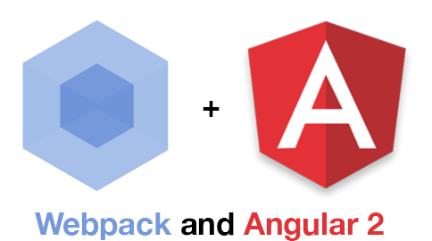

# ng2-seed

TODO: Description

# Getting Started

## Dependencies

## Commands

### Running the server
```
npm run start
```

### Run test
```
npm run test
```

### Build the app
```
npm run build
```

# License
 [MIT](/LICENSE)